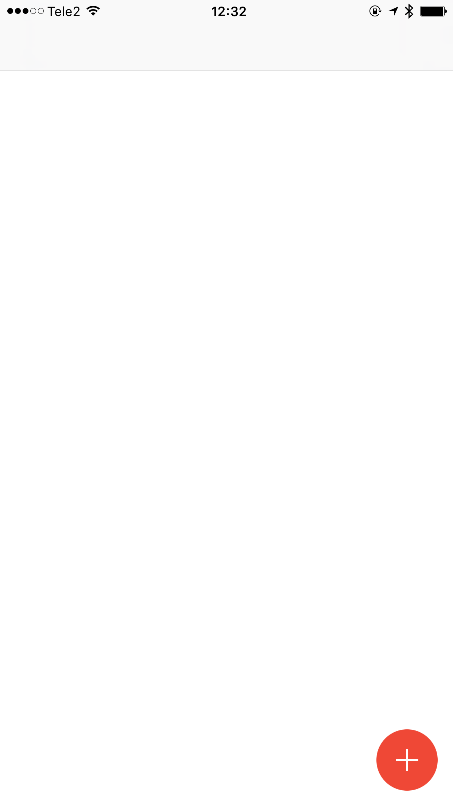
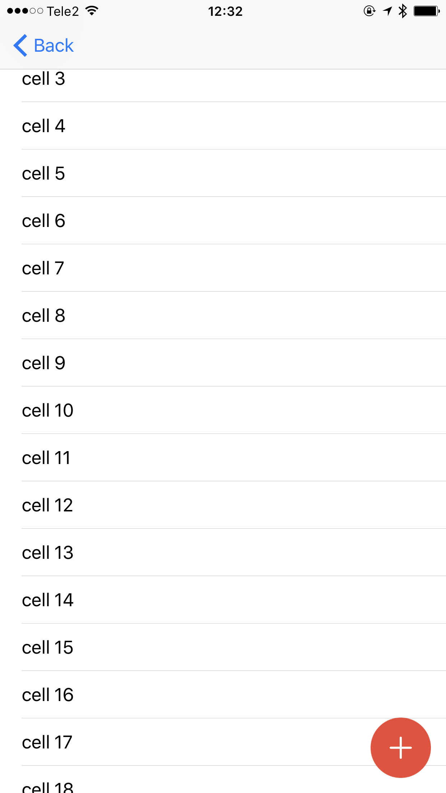

# DTZFloatingActionButton

[](https://travis-ci.org/hintoz/DTZFloatingActionButton)
[](http://cocoapods.org/pods/DTZFloatingActionButton)
[](http://cocoapods.org/pods/DTZFloatingActionButton)
[](http://cocoapods.org/pods/DTZFloatingActionButton)

Floating button for your ios app in swift.

 

## Requirements
* iOS 9.0+
* Swift 3.0
* Xcode 8

## Installation
### CocoaPods
DTZFloatingActionButton is available through [CocoaPods](http://cocoapods.org). To install
it, simply add the following line to your Podfile:
```ruby
pod "DTZFloatingActionButton"
```
### Manually
To install manually the DTZFloatingActionButton in an app, just drag the `DTZFloatingActionButton/Classes/*.swift` file into your project.

## Usage
### As Manager in UIWindow
#### Swift
```swift
DTZFABManager.shared.button().handler = {
    button in
    print("Tapped")
}
DTZFABManager.shared.show()
```
### In UIView
#### Swift
```swift
let actionButton = DTZFloatingActionButton()
        actionButton.handler = {
            button in
            self.performSegue(withIdentifier: "tableViewSegue", sender: nil)
        }
        
        self.view.addSubview(actionButton)
```
### In UITableView, UICollectionView
#### Swift
```swift
let actionButton = DTZFloatingActionButton()
        actionButton.handler = {
            button in
            print("Hi!")
        }
        actionButton.isScrollView = true
        self.view.addSubview(actionButton)
```
If you are using a navigation controller, use a custom initializer.
```swift
let actionButton = DTZFloatingActionButton(frame:CGRect(x: view.frame.size.width - 56 - 14,
                                                                y: view.frame.size.height - 56 - 14,
                                                                width: 56,
                                                                height: 56
        ))
```

## Example

To run the example project, clone the repo, and run `pod install` from the Example directory first.

## Author

Evgeny Dats (hintoz), hintoz@gmail.com

## License

DTZFloatingActionButton is available under the MIT license. See the LICENSE file for more info.
